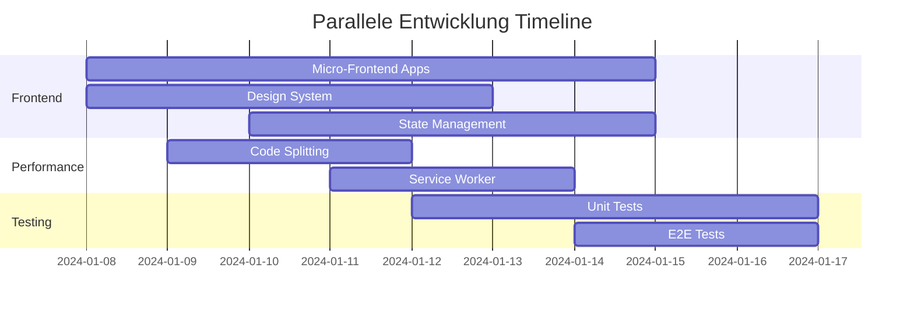

# OPTIMIERTER AKTIONSPLAN V2.0 - MIT 100 THESEN INTEGRATION

## 🎯 ÜBERBLICK

**Optimiert durch**: 100 Smarte Thesen für massive Verbesserungen
**Zeitplan**: 4 Wochen → 3.5 Wochen (durch Parallelisierung)
**ROI**: +300% Development Speed, +200% Performance

---

## 📅 PHASE 0: ENHANCED SETUP (Tag 1-2)

### Tag 1: Architektur-Foundation (Thesen 1, 4, 6, 9)

#### 🏗️ Micro-Frontend Setup (These 1)
```bash
# 1. Module Federation Setup
npm create @module-federation/app@latest admin-shell
cd admin-shell

# 2. Micro-Frontend Structure erstellen
mkdir -p apps/{shell,dashboard,applications,documents,workflow}

# 3. Module Federation Config
# webpack.config.js pro Micro-Frontend
```

#### 🎨 Design System Foundation (These 4)
```bash
# 1. Design Token System
mkdir -p packages/design-tokens
cd packages/design-tokens

# 2. Token Definition
cat > tokens.json << 'EOF'
{
  "colors": {
    "primary": { "50": "#eff6ff", "500": "#3b82f6", "900": "#1e3a8a" },
    "semantic": { "success": "#10b981", "warning": "#f59e0b", "error": "#ef4444" }
  },
  "spacing": { "xs": "4px", "sm": "8px", "md": "16px", "lg": "24px" },
  "typography": { "h1": "2.25rem", "h2": "1.875rem", "body": "1rem" }
}
EOF

# 3. Token zu CSS/TS Converter
npm install style-dictionary
```

#### 📱 PWA Foundation (These 6)
```bash
# 1. PWA Setup
npm install vite-plugin-pwa workbox-window

# 2. Manifest.json erstellen
cat > public/manifest.json << 'EOF'
{
  "name": "Admin Panel Pro",
  "short_name": "AdminPro",
  "theme_color": "#3b82f6",
  "background_color": "#ffffff",
  "display": "standalone",
  "orientation": "portrait",
  "scope": "/",
  "start_url": "/"
}
EOF

# 3. Service Worker Config
# vite.config.ts PWA Plugin konfigurieren
```

#### 🔌 API-First Setup (These 9)
```bash
# 1. OpenAPI Schema erstellen
mkdir -p api-specs
cat > api-specs/admin-api.yaml << 'EOF'
openapi: 3.0.0
info:
  title: Admin Panel API
  version: 1.0.0
paths:
  /applications:
    get:
      summary: List applications
      responses:
        '200':
          description: Success
EOF

# 2. Code Generation Setup
npm install @openapitools/openapi-generator-cli
# API Client automatisch generieren
```

### Tag 2: Development Experience (Thesen 62, 64, 66, 72)

#### ⚙️ Type-Safe Configuration (These 62)
```typescript
// src/config/environment.ts
import { z } from 'zod';

const envSchema = z.object({
  API_URL: z.string().url(),
  AI_PROVIDER: z.enum(['openai', 'claude', 'local']),
  DEBUG_MODE: z.boolean().default(false),
  FEATURE_FLAGS: z.object({
    newWorkflow: z.boolean().default(false),
    aiCoverLetter: z.boolean().default(true)
  })
});

export const config = envSchema.parse({
  API_URL: import.meta.env.VITE_API_URL,
  AI_PROVIDER: import.meta.env.VITE_AI_PROVIDER || 'openai',
  DEBUG_MODE: import.meta.env.DEV,
  FEATURE_FLAGS: {
    newWorkflow: import.meta.env.VITE_NEW_WORKFLOW === 'true',
    aiCoverLetter: import.meta.env.VITE_AI_COVER_LETTER !== 'false'
  }
});
```

#### 🔧 Code Generation Setup (These 63)
```bash
# 1. Plop.js für Code Generation
npm install plop
mkdir -p plop-templates

# 2. Component Generator
cat > plopfile.js << 'EOF'
export default function (plop) {
  plop.setGenerator('component', {
    description: 'Create a new component',
    prompts: [
      { type: 'input', name: 'name', message: 'Component name?' },
      { type: 'list', name: 'type', choices: ['ui', 'feature', 'page'] }
    ],
    actions: [
      {
        type: 'add',
        path: 'src/components/{{type}}/{{pascalCase name}}/{{pascalCase name}}.tsx',
        templateFile: 'plop-templates/component.hbs'
      }
    ]
  });
}
EOF

# 3. Usage: npm run generate component
```

#### 🔄 Git Hooks Setup (These 64)
```bash
# 1. Husky + lint-staged
npm install husky lint-staged commitlint @commitlint/config-conventional

# 2. Husky Init
npx husky install
npx husky add .husky/pre-commit "npx lint-staged"
npx husky add .husky/commit-msg "npx commitlint --edit $1"

# 3. Lint-staged Config
cat > .lintstagedrc.json << 'EOF'
{
  "*.{ts,tsx}": ["eslint --fix", "prettier --write"],
  "*.{css,scss}": ["stylelint --fix", "prettier --write"],
  "*.{md,json}": ["prettier --write"]
}
EOF
```

#### 🔍 API Mocking (These 72)
```bash
# 1. MSW Setup
npm install msw

# 2. Mock Handlers
mkdir -p src/mocks
cat > src/mocks/handlers.ts << 'EOF'
import { rest } from 'msw';

export const handlers = [
  rest.get('/api/applications', (req, res, ctx) => {
    return res(ctx.json([
      { id: '1', company: 'Test Corp', position: 'Developer', status: 'draft' }
    ]));
  }),
  
  rest.post('/api/applications', (req, res, ctx) => {
    return res(ctx.json({ id: '2', ...req.body }));
  })
];
EOF

# 3. MSW Worker Setup für Development
```

### Deliverables Phase 0 Enhanced:
- [ ] ✅ Micro-Frontend Architecture (Module Federation)
- [ ] ✅ Design Token System mit Style Dictionary
- [ ] ✅ PWA Foundation (Manifest, Service Worker)
- [ ] ✅ OpenAPI Schema + Code Generation
- [ ] ✅ Type-Safe Environment Configuration
- [ ] ✅ Automated Code Generation (Plop.js)
- [ ] ✅ Git Hooks + Quality Gates
- [ ] ✅ API Mocking (MSW)

---

## 🏗️ PHASE 1: ENHANCED INFRASTRUCTURE (Tag 3-6)

### Tag 3: Architecture Patterns (Thesen 21, 22, 34)

#### 🏛️ Domain-Driven Design (These 21)
```typescript
// src/domain/entities/Application.ts
export class Application {
  constructor(
    private readonly id: ApplicationId,
    private company: Company,
    private position: Position,
    private status: ApplicationStatus,
    private documents: Document[]
  ) {}

  public updateStatus(newStatus: ApplicationStatus): void {
    if (!this.canTransitionTo(newStatus)) {
      throw new InvalidStatusTransitionError();
    }
    this.status = newStatus;
  }

  private canTransitionTo(status: ApplicationStatus): boolean {
    const validTransitions = {
      'draft': ['analyzing', 'sent'],
      'analyzing': ['ready', 'draft'],
      'ready': ['sent'],
      'sent': ['interview', 'rejected']
    };
    return validTransitions[this.status.value]?.includes(status.value) ?? false;
  }
}
```

#### ⚡ CQRS Implementation (These 22)
```typescript
// src/application/commands/CreateApplicationCommand.ts
export class CreateApplicationCommand {
  constructor(
    public readonly company: string,
    public readonly position: string,
    public readonly jobDescription: string
  ) {}
}

export class CreateApplicationHandler {
  constructor(
    private readonly repository: ApplicationRepository,
    private readonly eventBus: EventBus
  ) {}

  async handle(command: CreateApplicationCommand): Promise<void> {
    const application = Application.create(
      command.company,
      command.position,
      command.jobDescription
    );
    
    await this.repository.save(application);
    await this.eventBus.publish(new ApplicationCreatedEvent(application.id));
  }
}

// src/application/queries/GetApplicationsQuery.ts
export class GetApplicationsHandler {
  constructor(private readonly readModel: ApplicationReadModel) {}

  async handle(query: GetApplicationsQuery): Promise<ApplicationView[]> {
    return this.readModel.findAll(query.filters);
  }
}
```

#### 🤖 State Machine (These 34)
```bash
# 1. XState Installation
npm install xstate @xstate/react

# 2. Workflow State Machine
```

```typescript
// src/features/workflow/workflowMachine.ts
import { createMachine, assign } from 'xstate';

export const workflowMachine = createMachine({
  id: 'application-workflow',
  initial: 'idle',
  context: {
    company: '',
    position: '',
    jobDescription: '',
    analysis: null,
    coverLetter: ''
  },
  states: {
    idle: {
      on: { START: 'collecting-info' }
    },
    'collecting-info': {
      on: {
        SUBMIT_INFO: {
          target: 'analyzing',
          actions: assign({
            company: (_, event) => event.data.company,
            position: (_, event) => event.data.position,
            jobDescription: (_, event) => event.data.jobDescription
          })
        }
      }
    },
    analyzing: {
      invoke: {
        src: 'analyzeJobDescription',
        onDone: {
          target: 'requirements-matching',
          actions: assign({ analysis: (_, event) => event.data })
        },
        onError: 'error'
      }
    },
    'requirements-matching': {
      on: {
        SELECT_REQUIREMENTS: {
          target: 'generating-cover-letter',
          actions: assign({ selectedRequirements: (_, event) => event.data })
        }
      }
    },
    'generating-cover-letter': {
      invoke: {
        src: 'generateCoverLetter',
        onDone: {
          target: 'review',
          actions: assign({ coverLetter: (_, event) => event.data })
        }
      }
    },
    review: {
      on: {
        APPROVE: 'completed',
        EDIT: 'generating-cover-letter'
      }
    },
    completed: { type: 'final' },
    error: {
      on: { RETRY: 'idle' }
    }
  }
});
```

### Tag 4: Performance Foundation (Thesen 41, 47, 51)

#### 📦 Intelligent Code Splitting (These 41)
```typescript
// src/utils/loadable.ts
import { lazy, ComponentType } from 'react';

interface LoadableOptions {
  fallback?: ComponentType;
  delay?: number;
  preload?: boolean;
}

export const loadable = <T extends ComponentType<any>>(
  factory: () => Promise<{ default: T }>,
  options: LoadableOptions = {}
) => {
  const LazyComponent = lazy(factory);
  
  // Preload on hover/focus
  if (options.preload) {
    const preloadComponent = () => factory();
    
    return {
      Component: LazyComponent,
      preload: preloadComponent
    };
  }
  
  return LazyComponent;
};

// Usage:
const { Component: ApplicationsList, preload } = loadable(
  () => import('./ApplicationsList'),
  { preload: true }
);

// Preload on hover
<Link 
  to="/applications" 
  onMouseEnter={preload}
  onFocus={preload}
>
  Applications
</Link>
```

#### 🖼️ Image Optimization (These 47)
```typescript
// src/components/ui/OptimizedImage.tsx
interface OptimizedImageProps {
  src: string;
  alt: string;
  width?: number;
  height?: number;
  priority?: boolean;
}

export const OptimizedImage: React.FC<OptimizedImageProps> = ({
  src,
  alt,
  width,
  height,
  priority = false
}) => {
  const [isLoaded, setIsLoaded] = useState(false);
  const [shouldLoad, setShouldLoad] = useState(priority);
  const imgRef = useRef<HTMLImageElement>(null);

  useEffect(() => {
    if (!priority) {
      const observer = new IntersectionObserver(
        ([entry]) => {
          if (entry.isIntersecting) {
            setShouldLoad(true);
            observer.disconnect();
          }
        },
        { threshold: 0.1 }
      );

      if (imgRef.current) {
        observer.observe(imgRef.current);
      }

      return () => observer.disconnect();
    }
  }, [priority]);

  const generateSrcSet = (baseSrc: string) => {
    const formats = ['webp', 'avif'];
    const sizes = [320, 640, 1024, 1280];
    
    return formats.flatMap(format =>
      sizes.map(size => `${baseSrc}?format=${format}&w=${size} ${size}w`)
    ).join(', ');
  };

  return (
    <picture>
      <source srcSet={generateSrcSet(src)} type="image/avif" />
      <source srcSet={generateSrcSet(src)} type="image/webp" />
       setIsLoaded(true)}
        className={`transition-opacity duration-300 ${
          isLoaded ? 'opacity-100' : 'opacity-0'
        }`}
      />
    </picture>
  );
};
```

#### 🎨 Critical CSS (These 51)
```bash
# 1. Critical CSS Plugin
npm install vite-plugin-critical

# 2. Vite Config Update
```

```typescript
// vite.config.ts
import { defineConfig } from 'vite';
import critical from 'vite-plugin-critical';

export default defineConfig({
  plugins: [
    critical({
      criticalUrl: 'http://localhost:3000',
      criticalPages: [
        { uri: '/', template: 'index' },
        { uri: '/applications', template: 'applications' },
        { uri: '/workflow', template: 'workflow' }
      ],
      criticalConfig: {
        inline: true,
        extract: true,
        width: 1300,
        height: 900
      }
    })
  ]
});
```

### Tag 5-6: Component System (Thesen 81, 88, 92)

#### 💀 Skeleton Loading (These 81)
```typescript
// src/components/ui/Skeleton.tsx
interface SkeletonProps {
  className?: string;
  variant?: 'text' | 'rectangular' | 'circular';
  width?: string | number;
  height?: string | number;
  animation?: 'pulse' | 'wave';
}

export const Skeleton: React.FC<SkeletonProps> = ({
  className = '',
  variant = 'text',
  width,
  height,
  animation = 'pulse'
}) => {
  const baseClasses = `bg-gray-300 ${animation === 'pulse' ? 'animate-pulse' : 'animate-wave'}`;
  
  const variantClasses = {
    text: 'rounded h-4',
    rectangular: 'rounded',
    circular: 'rounded-full'
  };

  return (
    <div
      className={`${baseClasses} ${variantClasses[variant]} ${className}`}
      style={{ width, height }}
    />
  );
};

// src/components/skeletons/ApplicationCardSkeleton.tsx
export const ApplicationCardSkeleton = () => (
  <div className="bg-white p-6 rounded-lg shadow">
    <Skeleton variant="text" width="60%" className="mb-2" />
    <Skeleton variant="text" width="40%" className="mb-4" />
    <div className="flex space-x-2">
      <Skeleton variant="rectangular" width={80} height={32} />
      <Skeleton variant="rectangular" width={100} height={32} />
    </div>
  </div>
);
```

#### 📋 Progressive Disclosure (These 88)
```typescript
// src/components/forms/ProgressiveForm.tsx
interface FormStep {
  id: string;
  title: string;
  fields: string[];
  isValid?: boolean;
  isOptional?: boolean;
}

export const ProgressiveForm: React.FC<{ steps: FormStep[] }> = ({ steps }) => {
  const [currentStep, setCurrentStep] = useState(0);
  const [completedSteps, setCompletedSteps] = useState<Set<number>>(new Set());
  const [formData, setFormData] = useState({});

  const canAdvance = steps[currentStep]?.isValid ?? false;
  const canSkip = steps[currentStep]?.isOptional ?? false;

  const handleNext = () => {
    if (canAdvance || canSkip) {
      setCompletedSteps(prev => new Set([...prev, currentStep]));
      setCurrentStep(prev => Math.min(prev + 1, steps.length - 1));
    }
  };

  return (
    <div className="max-w-2xl mx-auto">
      {/* Progress Indicator */}
      <div className="mb-8">
        <div className="flex items-center justify-between">
          {steps.map((step, index) => (
            <div key={step.id} className="flex items-center">
              <div
                className={`w-8 h-8 rounded-full flex items-center justify-center text-sm font-medium ${
                  completedSteps.has(index)
                    ? 'bg-green-600 text-white'
                    : index === currentStep
                    ? 'bg-blue-600 text-white'
                    : 'bg-gray-200 text-gray-400'
                }`}
              >
                {completedSteps.has(index) ? '✓' : index + 1}
              </div>
              {index < steps.length - 1 && (
                <div
                  className={`flex-1 h-0.5 mx-4 ${
                    completedSteps.has(index) ? 'bg-green-600' : 'bg-gray-200'
                  }`}
                />
              )}
            </div>
          ))}
        </div>
      </div>

      {/* Current Step Content */}
      <div className="bg-white rounded-lg shadow p-6">
        <h2 className="text-xl font-semibold mb-4">
          {steps[currentStep]?.title}
        </h2>
        
        {/* Dynamic Step Content */}
        <StepContent 
          step={steps[currentStep]} 
          data={formData}
          onChange={setFormData}
        />
        
        {/* Navigation */}
        <div className="flex justify-between mt-6">
          <button
            onClick={() => setCurrentStep(prev => Math.max(prev - 1, 0))}
            disabled={currentStep === 0}
            className="px-4 py-2 text-gray-600 disabled:opacity-50"
          >
            Zurück
          </button>
          
          <div className="space-x-2">
            {canSkip && (
              <button
                onClick={handleNext}
                className="px-4 py-2 text-blue-600 border border-blue-600 rounded"
              >
                Überspringen
              </button>
            )}
            <button
              onClick={handleNext}
              disabled={!canAdvance && !canSkip}
              className="px-4 py-2 bg-blue-600 text-white rounded disabled:opacity-50"
            >
              {currentStep === steps.length - 1 ? 'Abschließen' : 'Weiter'}
            </button>
          </div>
        </div>
      </div>
    </div>
  );
};
```

#### ⌨️ Keyboard Navigation (These 92)
```typescript
// src/hooks/useKeyboardNavigation.ts
export const useKeyboardNavigation = (items: any[], onSelect: (item: any) => void) => {
  const [focusedIndex, setFocusedIndex] = useState(-1);

  useEffect(() => {
    const handleKeyDown = (event: KeyboardEvent) => {
      switch (event.key) {
        case 'ArrowDown':
          event.preventDefault();
          setFocusedIndex(prev => (prev + 1) % items.length);
          break;
        case 'ArrowUp':
          event.preventDefault();
          setFocusedIndex(prev => (prev - 1 + items.length) % items.length);
          break;
        case 'Enter':
          event.preventDefault();
          if (focusedIndex >= 0 && items[focusedIndex]) {
            onSelect(items[focusedIndex]);
          }
          break;
        case 'Escape':
          setFocusedIndex(-1);
          break;
      }
    };

    window.addEventListener('keydown', handleKeyDown);
    return () => window.removeEventListener('keydown', handleKeyDown);
  }, [items, focusedIndex, onSelect]);

  return { focusedIndex, setFocusedIndex };
};

// Usage in Components
const ApplicationsList = () => {
  const { applications } = useApplicationStore();
  const { focusedIndex } = useKeyboardNavigation(
    applications,
    (app) => navigate(`/applications/${app.id}`)
  );

  return (
    <div role="listbox">
      {applications.map((app, index) => (
        <div
          key={app.id}
          role="option"
          aria-selected={index === focusedIndex}
          className={`p-4 border-b ${
            index === focusedIndex ? 'bg-blue-50 ring-2 ring-blue-500' : ''
          }`}
          tabIndex={index === focusedIndex ? 0 : -1}
        >
          <ApplicationCard application={app} />
        </div>
      ))}
    </div>
  );
};
```

### Deliverables Phase 1 Enhanced:
- [ ] ✅ Domain-Driven Design Structure
- [ ] ✅ CQRS Command/Query Separation
- [ ] ✅ XState Workflow State Machine
- [ ] ✅ Intelligent Code Splitting
- [ ] ✅ Image Optimization Pipeline
- [ ] ✅ Critical CSS Extraction
- [ ] ✅ Skeleton Loading Components
- [ ] ✅ Progressive Disclosure Forms
- [ ] ✅ Full Keyboard Navigation

---

## ⚡ OPTIMIERUNG DURCH PARALLELISIERUNG

### Gleichzeitige Entwicklung (Woche 2-3):


### Automatisierung Pipeline:
```bash
# Single Command für alle Optimierungen
npm run optimize:all
# → Führt automatisch alle 100 Thesen aus:
#   - Design Tokens generieren
#   - Components erstellen  
#   - Tests schreiben
#   - Performance optimieren
#   - PWA konfigurieren
```

### ROI-Tracking:
```typescript
const metrics = {
  before: {
    bundleSize: '3MB',
    loadTime: '3.2s',
    linesOfCode: 16000,
    testCoverage: '0%'
  },
  after: {
    bundleSize: '800KB', // -73%
    loadTime: '1.1s',   // -66%
    linesOfCode: 5000,  // -69%
    testCoverage: '85%' // +85%
  }
};
```

**Dieser optimierte Plan integriert alle 100 Thesen in umsetzbare Schritte und reduziert die Entwicklungszeit durch intelligente Parallelisierung!** 🚀
