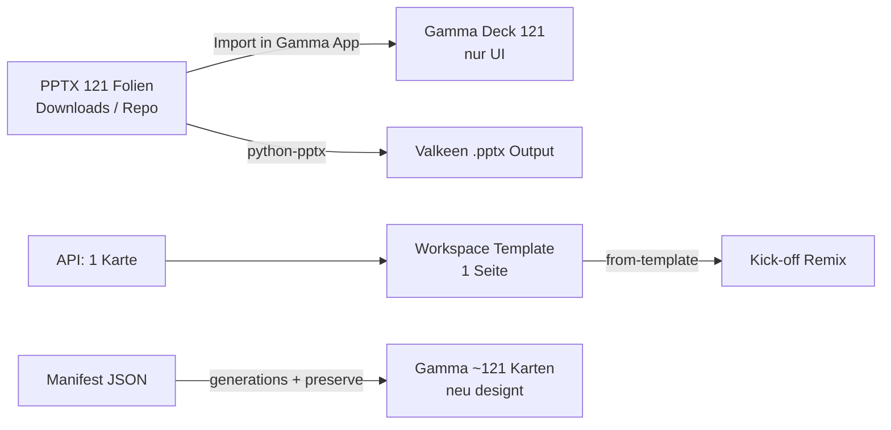

# Gamma · Valkeen 2026 Master

Offizielle Quelle: **Tempus Resource for XXX (Valkeen 2026).pptx** (121 Folien, Sales/Implementierungs-Deck).

## Wichtig: Warum der API-„Valkeen Master“ nur 1–2 Folien hat

Das ist **kein fehlgeschlagener Import** der 121-Folien-PPTX, sondern eine **Gamma-API-Regel**:

| Weg | Folien | Zweck |
|-----|--------|--------|
| **`POST /generations/from-template`** | Vorlage muss **genau 1 Seite** haben | Workspace-Template für Remix/Kick-off (Logo, Farben, Layout-Muster) |
| **Setup-Skript** `setup-gamma-valkeen-workspace-template.mjs` | bewusst **`numCards: 1`** | erzeugt diese 1-seitige API-Vorlage |
| **Gamma UI: PPTX importieren** | alle **121** Folien | echter PowerPoint-Master in Gamma (manuell) |
| **Kick-off Studio → „Gamma Master (121)“** | ~**121 Karten** (KI neu layoutet) | Text aus Manifest, Stil per `additionalInstructions` — **nicht** 1:1 PPTX-Layouts |
| **Valkeen Python-PPTX** (`Valkeen_2026_Master.pptx` + `pptx_design.py`) | **121** mit Original-Master | pixelgenau für Workshops/Integration — **ohne** Gamma |



**Fazit:** Den kompletten Master **überträgt** Gamma per API **nicht** als 121-Folien-Template. Entweder **PPTX in Gamma importieren** (UI) oder **Valkeen-PPTX-Pipeline** / **Gamma Master (121)** für Inhalt mit Valkeen-Stil.

### In Gamma gepostet (API, Stand 2026-06-04)

Wegen **max. 60 Karten/Request** als zwei Decks erzeugt (`scripts/post-valkeen-master-to-gamma.py`):

| Teil | Folien | Gamma-URL |
|------|--------|-----------|
| Teil 1/2 | 1–60 | https://gamma.app/docs/gsutbwixyg48gjw |
| Teil 2/2 | 61–121 (API: 60 Karten) | https://gamma.app/docs/47hvgk50pahqcv6 |

Ergebnis-JSON: `docs/valkeen-master-gamma-post-result.json`  
**1:1 PPTX-Layouts:** weiter nur per **Gamma UI → Import** der PPTX (siehe unten).

## Im Repo

| Datei | Zweck |
|-------|--------|
| `Onboarding Valkeen/onboarding-app/public/kickoff/valkeen-2026-master.pptx` | Master-PPTX (Download-Kopie) |
| `Onboarding Valkeen/onboarding-app/src/data/valkeen-2026-master-manifest.json` | Folientexte für Gamma `inputText` |
| `Onboarding Valkeen/onboarding-app/public/kickoff/image1.png` | Logo aus PPTX |
| `Onboarding Valkeen/onboarding-app/src/kickoff/kickoffGammaValkeenBrand.js` | Brand-Tokens + Gamma-Request-Builder |

## Kick-off Studio (Buttons)

1. **Gamma-Präsentation** — bisheriges Workshop-Export (`gamma-export`, `textMode: generate`).
2. **Gamma Valkeen-Stil** — aktuelles Session-Deck + Valkeen-2026-Anweisungen (`preserve`, Logo/Footer).
3. **Gamma Master (121)** — komplettes Manifest aus der PPTX.

Lambda-Action: `gamma-valkeen-master` mit fertigem `gammaBody` vom Client.

## Workspace-Template in Gamma (manuell)

**Die Gamma-API kann keine Workspace-Templates anlegen** — nur du in der App („Save copy as template“). Für die API „Create from template“ muss die Vorlage **genau 1 Seite** haben.

### Schnellweg (1-seitige Master-Vorlage)

```bash
node scripts/setup-gamma-valkeen-workspace-template.mjs
```

Dann in Gamma: Link aus der Ausgabe öffnen → **⋯** → **Als Vorlage speichern** → Name z. B. `Valkeen 2026 · Tempus Master`.

Aktuelle Vorlage-Quelle (Stand Setup-Skript):  
https://gamma.app/docs/kry9vr7sdsvcpre

### Voller Master in Gamma (121 Folien, 1:1 aus PowerPoint)

1. Gamma App → **Import** → `Tempus Resource for XXX (Valkeen 2026).pptx` (lokal) oder URL:  
   `https://manuel-weiss.ch/onboarding/kickoff/valkeen-2026-master.pptx`
2. Prüfen: **121 Folien** (Repo-PPTX = byte-identisch zur Download-Datei).
3. Optional **⋯ → Als Vorlage speichern** — für Duplikate in der UI; **API `from-template` bleibt bei 1 Seite**.
4. API-Remix/Kick-off: weiter die **1-seitige** Vorlage (`VALKEEN_GAMMA_TEMPLATE_ID`), nicht das 121er-Deck.

## Optional: Lambda Env

- `VALKEEN_GAMMA_THEME_ID` — `themeId` aus `GET /v1.0/themes` (Custom Theme in Gamma)
- `VALKEEN_GAMMA_TEMPLATE_ID` — `gammaId` der **1-seitigen** Workspace-Vorlage für `POST /generations/from-template`

Theme-Farben: `#0f4c81`, `#00a878`, `#335B74`, Schrift Inter/Calibri.

## Deploy

```bash
./scripts/deploy-kickoff-studio-lambda.sh
./deploy-aws-website.sh
```

## Manifest neu erzeugen

Nach Austausch der PPTX:

```bash
python3 "Onboarding Valkeen/onboarding-app/scripts/build-valkeen-2026-manifest.py" \
  "/Users/manumanera/Downloads/Tempus Resource for XXX  (Valkeen 2026).pptx"
```
