# AI Investment System - Architektur

## Systemarchitektur Übersicht

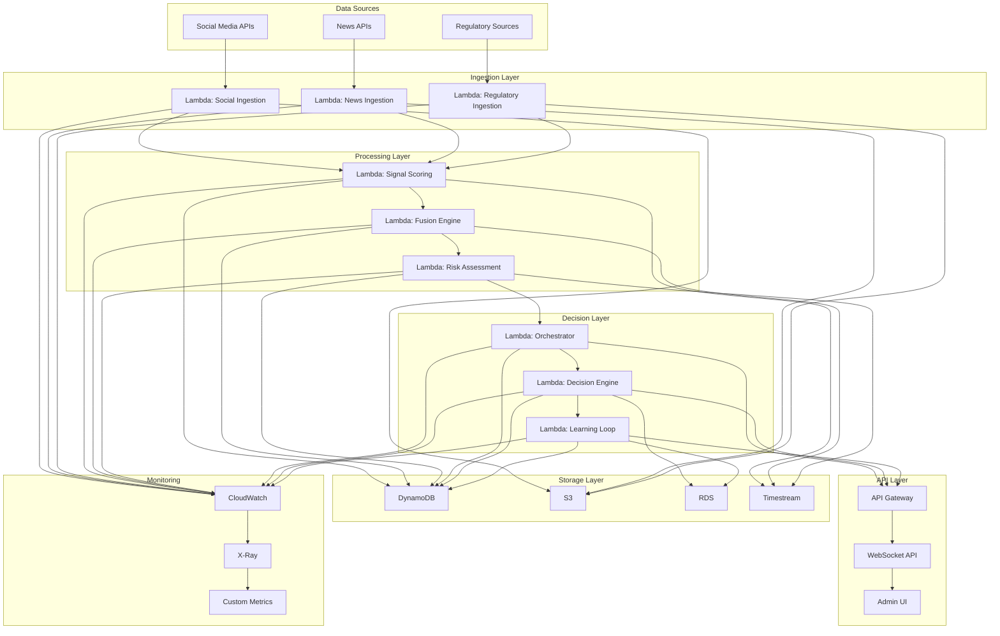

## Datenfluss

### 1. Data Ingestion

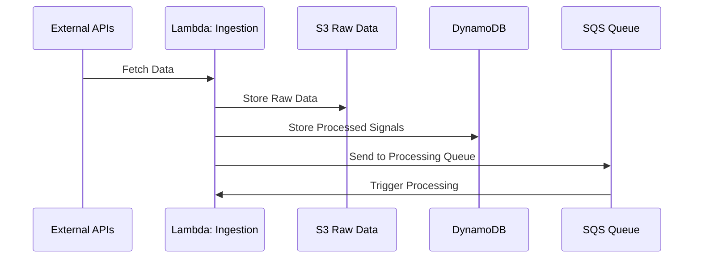

### 2. Signal Processing

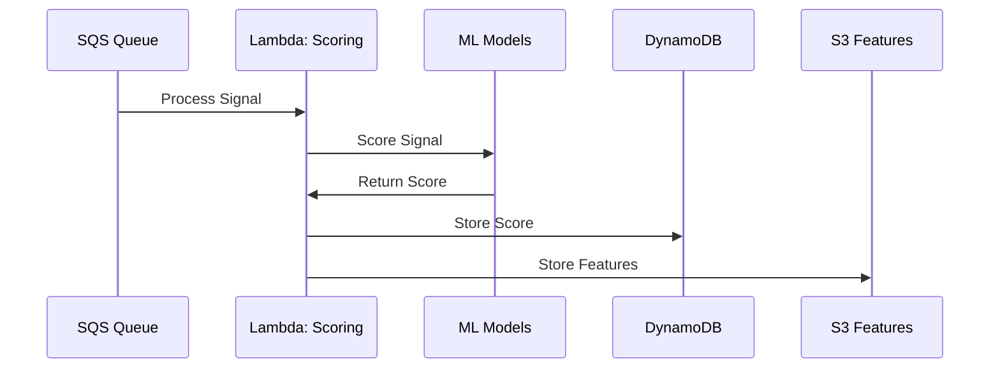

### 3. Decision Making

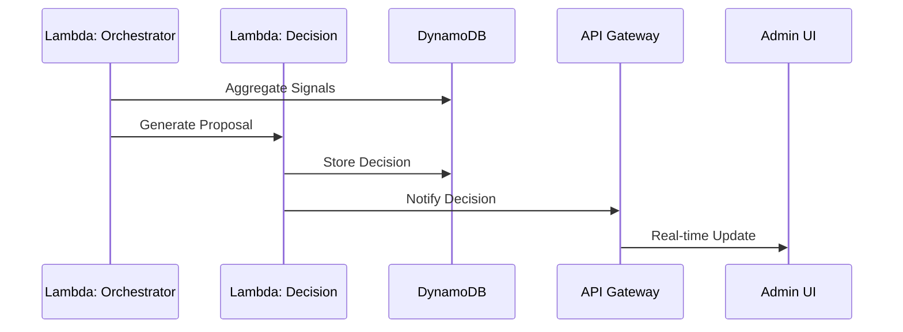

## Infrastruktur-Komponenten

### AWS Services

| Service | Zweck | Konfiguration |
|---------|-------|----------------|
| **Lambda** | Serverless Functions | Node.js 20, 512MB-3GB RAM |
| **DynamoDB** | NoSQL Database | On-Demand, PITR enabled |
| **S3** | Object Storage | Standard, Lifecycle Policies |
| **API Gateway** | REST API | Regional, CORS enabled |
| **CloudWatch** | Monitoring | Logs, Metrics, Alarms |
| **SQS** | Message Queue | Standard, DLQ enabled |
| **EventBridge** | Event Routing | Custom Rules |
| **Cognito** | Authentication | User Pool, MFA |
| **KMS** | Encryption | Customer Managed Keys |
| **Secrets Manager** | Secret Storage | Automatic Rotation |

### Netzwerk-Architektur

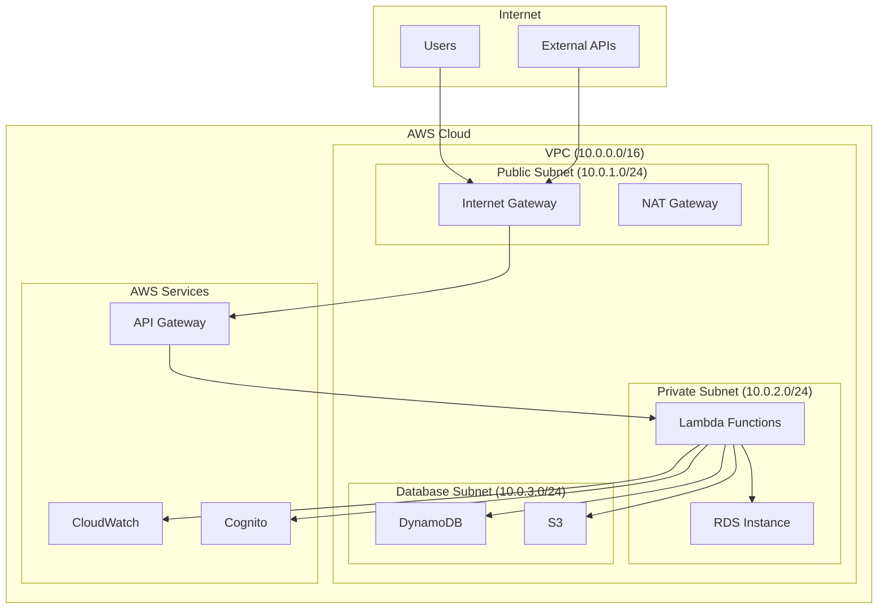

## Sicherheitsarchitektur

### IAM Rollen und Policies

```yaml
# Lambda Execution Role
LambdaExecutionRole:
  Type: AWS::IAM::Role
  Properties:
    AssumeRolePolicyDocument:
      Version: '2012-10-17'
      Statement:
        - Effect: Allow
          Principal:
            Service: lambda.amazonaws.com
          Action: sts:AssumeRole
    Policies:
      - PolicyName: LambdaBasicExecution
        PolicyDocument:
          Version: '2012-10-17'
          Statement:
            - Effect: Allow
              Action:
                - logs:CreateLogGroup
                - logs:CreateLogStream
                - logs:PutLogEvents
              Resource: '*'
      - PolicyName: DynamoDBAccess
        PolicyDocument:
          Version: '2012-10-17'
          Statement:
            - Effect: Allow
              Action:
                - dynamodb:GetItem
                - dynamodb:PutItem
                - dynamodb:Query
                - dynamodb:Scan
              Resource: !Sub 'arn:aws:dynamodb:${AWS::Region}:${AWS::AccountId}:table/ai-investment-*'
```

### Verschlüsselung

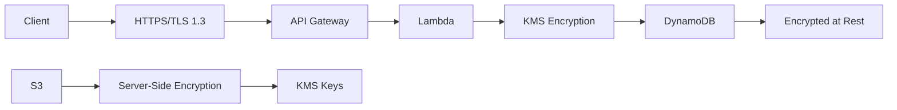

## Performance-Architektur

### Caching-Strategie

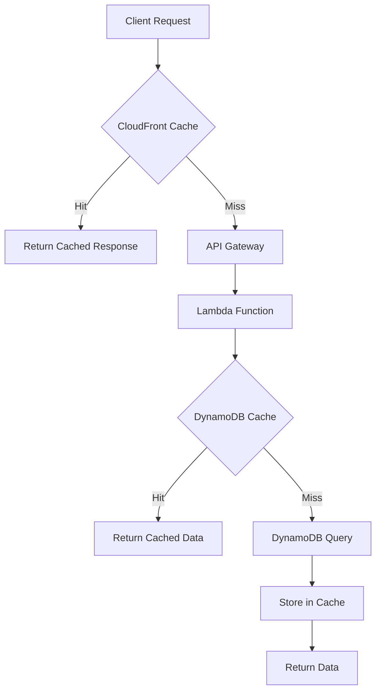

### Auto-Scaling

```yaml
# DynamoDB Auto Scaling
AutoScalingTarget:
  Type: AWS::ApplicationAutoScaling::ScalableTarget
  Properties:
    MaxCapacity: 1000
    MinCapacity: 5
    ResourceId: !Sub 'table/${DynamoDBTable}'
    RoleARN: !GetAtt AutoScalingRole.Arn
    ScalableDimension: dynamodb:table:ReadCapacityUnits
    ServiceNamespace: dynamodb

# Lambda Provisioned Concurrency
ProvisionedConcurrency:
  Type: AWS::Lambda::ProvisionedConcurrencyConfig
  Properties:
    FunctionName: !Ref LambdaFunction
    ProvisionedConcurrencyConfig:
      ProvisionedConcurrencyCount: 10
```

## Monitoring-Architektur

### CloudWatch Dashboards

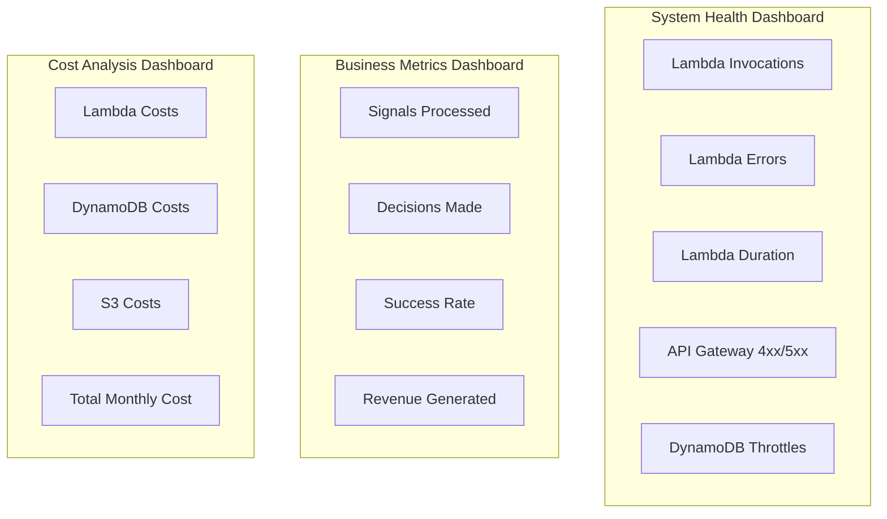

### Alerting

```yaml
# CloudWatch Alarms
HighErrorRate:
  Type: AWS::CloudWatch::Alarm
  Properties:
    AlarmName: HighErrorRate
    AlarmDescription: High error rate detected
    MetricName: Errors
    Namespace: AWS/Lambda
    Statistic: Sum
    Period: 300
    EvaluationPeriods: 2
    Threshold: 10
    ComparisonOperator: GreaterThanThreshold
    AlarmActions:
      - !Ref SNSTopic
```

## Deployment-Architektur

### CI/CD Pipeline

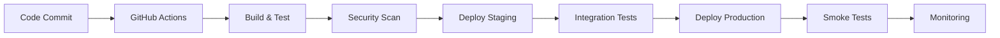

### Environment Strategy

```yaml
# Environment Configuration
Environments:
  Development:
    DynamoDB:
      BillingMode: ON_DEMAND
    Lambda:
      MemorySize: 128
      Timeout: 30
    Monitoring:
      LogLevel: DEBUG
  
  Staging:
    DynamoDB:
      BillingMode: PROVISIONED
      ReadCapacity: 5
      WriteCapacity: 5
    Lambda:
      MemorySize: 256
      Timeout: 60
    Monitoring:
      LogLevel: INFO
  
  Production:
    DynamoDB:
      BillingMode: ON_DEMAND
      PointInTimeRecovery: true
    Lambda:
      MemorySize: 512
      Timeout: 120
      ReservedConcurrency: 100
    Monitoring:
      LogLevel: WARN
```

## Disaster Recovery

### Backup-Strategie

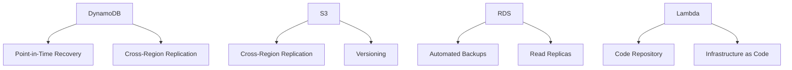

### RTO/RPO Ziele

| Komponente | RTO | RPO | Strategie |
|------------|-----|-----|-----------|
| **API Gateway** | 5 min | 0 min | Multi-AZ |
| **Lambda** | 1 min | 0 min | Code Repository |
| **DynamoDB** | 15 min | 5 min | PITR + Cross-Region |
| **S3** | 30 min | 1 hour | Cross-Region Replication |
| **RDS** | 1 hour | 15 min | Automated Backups |

## Kostenoptimierung

### Cost Allocation

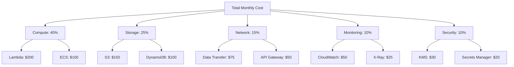

### Optimierungsstrategien

1. **Lambda**
   - Provisioned Concurrency für kritische Funktionen
   - Memory-Optimierung basierend auf Profiling
   - Dead Letter Queues für Fehlerbehandlung

2. **DynamoDB**
   - On-Demand für unvorhersagbare Workloads
   - DynamoDB Accelerator (DAX) für Caching
   - TTL für automatische Datenbereinigung

3. **S3**
   - Lifecycle Policies für automatische Archivierung
   - Intelligent Tiering für selten genutzte Daten
   - Compression für große Dateien

4. **Monitoring**
   - Log Retention Policies
   - Custom Metrics nur bei Bedarf
   - Alarm-Optimierung

## Skalierbarkeit

### Horizontal Scaling

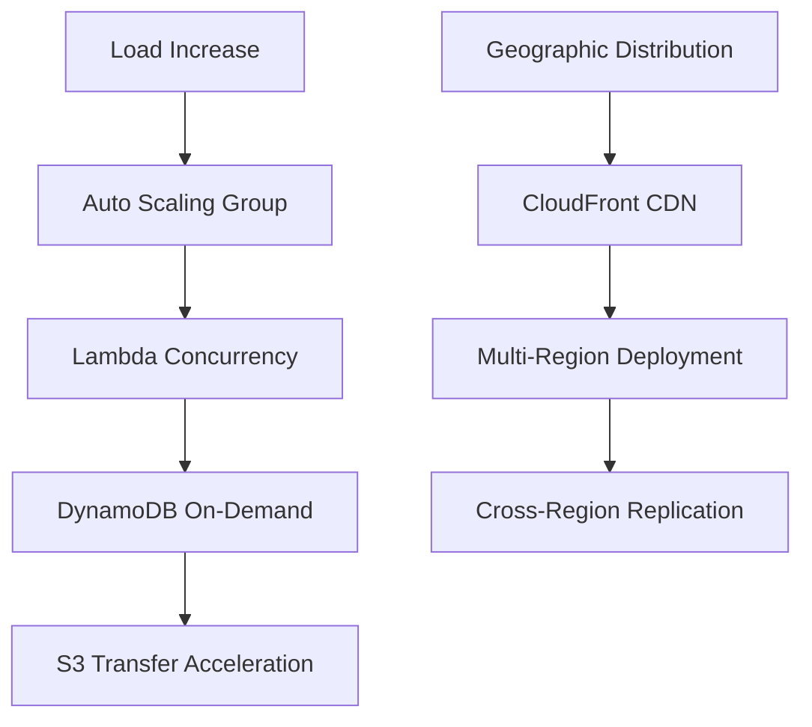

### Vertical Scaling

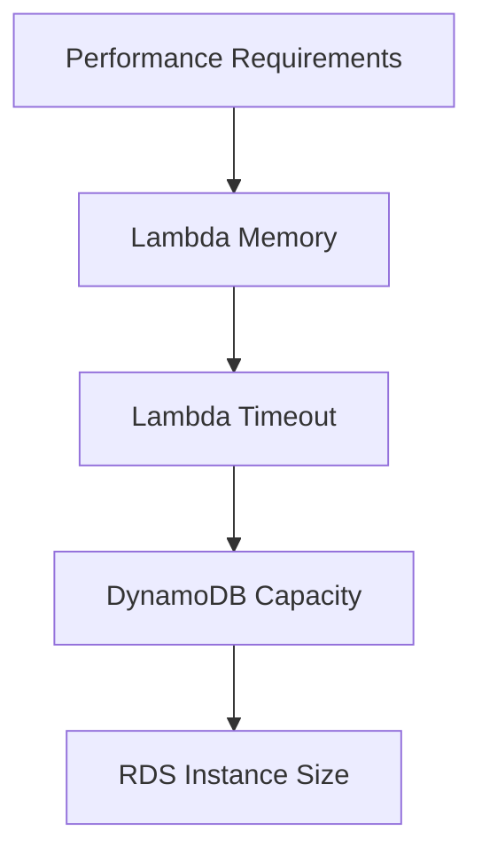

## Compliance & Governance

### DSGVO Compliance

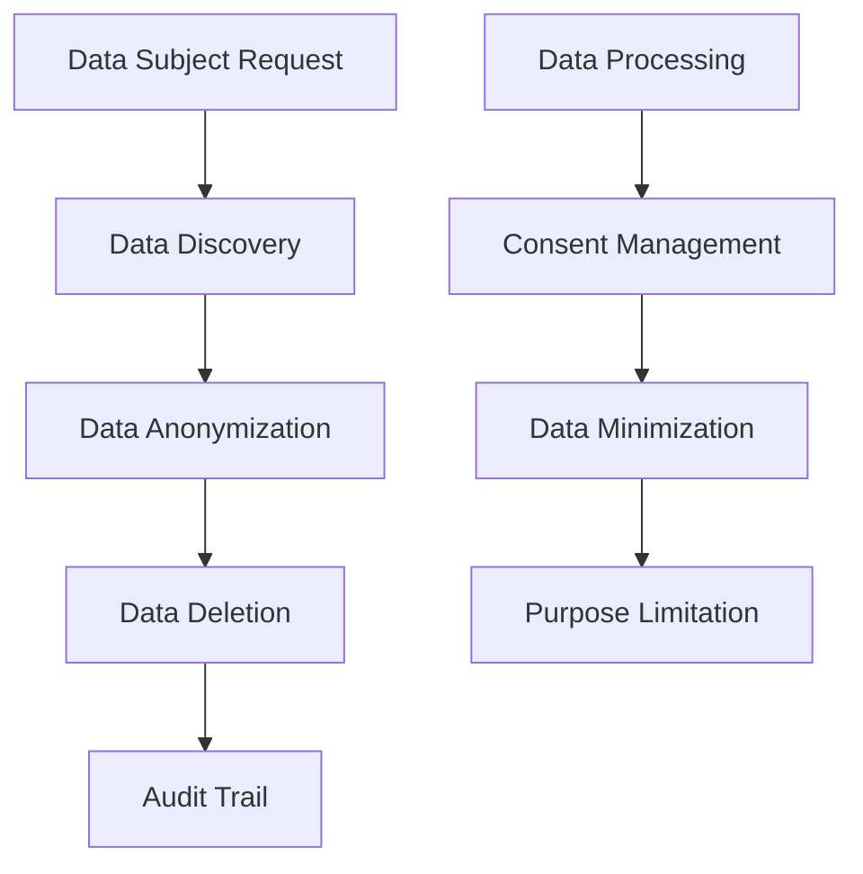

### Audit Trail

```yaml
# CloudTrail Configuration
CloudTrail:
  Type: AWS::CloudTrail::Trail
  Properties:
    TrailName: ai-investment-audit-trail
    S3BucketName: !Ref AuditLogsBucket
    IncludeGlobalServiceEvents: true
    IsMultiRegionTrail: true
    EventSelectors:
      - ReadWriteType: All
        IncludeManagementEvents: true
        DataResources:
          - Type: AWS::S3::Object
            Values:
              - !Sub '${S3Bucket}/*'
```

Diese Architektur-Dokumentation bietet eine umfassende Übersicht über das AI Investment System und dient als Referenz für Entwicklung, Deployment und Wartung.
