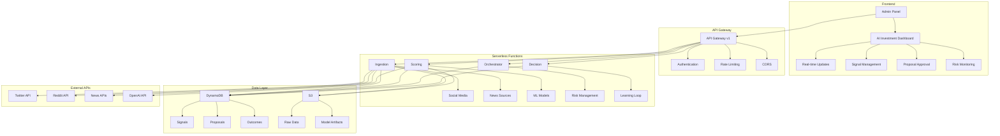

# AI Investment System - Technische Übersicht

**Repository:** `Manu-Manera/manuel-weiss-website` • **Version:** 5.0 • **Zeitzone:** Europe/Zurich  
**Prinzip:** *Kein Test-/Demo-Daten-Einsatz. Nur echte Quellen/Provider. Serverseitige Secrets.*

## Tech-Stack Analyse

### Frontend
- **Framework:** Vanilla JavaScript mit modularem Admin Panel
- **Node.js Version:** >=18.0.0 (engines in package.json)
- **Package Manager:** npm (basierend auf package-lock.json)
- **Build-Tools:** Custom Scripts (./scripts/build.sh)
- **Styling:** CSS3 mit modernen Features, Font Awesome Icons
- **Admin Panel:** Modulares System mit Lazy Loading

### Backend
- **Serverless:** Netlify Functions (netlify/functions/)
- **AWS Services:** Lambda, DynamoDB, S3, API Gateway, Cognito
- **Infrastructure:** AWS CDK (TypeScript)
- **Database:** DynamoDB mit GSI für Performance
- **Storage:** S3 für Raw Data, Model Artifacts, Exports

### AI/ML Stack
- **LLM Provider:** OpenAI (serverseitig)
- **Data Sources:** Twitter API, Reddit API, News APIs, Finanz-APIs
- **ML Models:** Custom Models für Sentiment, Relevance, Novelty, Credibility
- **Ensemble Methods:** Weighted Fusion, Bayesian Fusion, Meta-Learning

## Deploy-Ziele

### Primary Deployment
- **Netlify:** Frontend Hosting, Serverless Functions
- **AWS:** Backend Services, ML Models, Data Storage
- **GitHub:** Source Code, CI/CD Pipeline

### Infrastructure
- **CDK Stacks:** DataStack, ApiStack, ComputeStack, AuthStack, ObservabilityStack, SecurityStack
- **Multi-Region:** Europe (Frankfurt) + US (Virginia) für Disaster Recovery
- **Security:** KMS Encryption, Secrets Manager, IAM Least Privilege

## Konkrete Integrationspunkte

### Admin Panel Integration
```
admin/sections/ai-investments.js (bereits vorhanden)
├── Dashboard Widgets
├── Real-time Updates
├── Signal Management
├── Proposal Approval
├── Risk Monitoring
└── Learning Metrics
```

### Backend Services
```
netlify/functions/
├── ai-investment-ingest-social.js
├── ai-investment-ingest-news.js
├── ai-investment-score.js
├── ai-investment-propose.js
├── ai-investment-risk-check.js
├── ai-investment-decision.js
└── ai-investment-evaluate.js

lambda/
├── ingestion-social/
├── ingestion-news/
├── scoring/
├── orchestrator/
├── evaluation/
└── streaming/
```

### API Structure
```
/v1/
├── ingest/social (POST)
├── ingest/news (POST)
├── score (POST)
├── propose (POST)
├── risk/check (POST)
├── decision (POST)
├── evaluate (POST)
├── dashboard/summary (GET)
├── dashboard/stream (GET)
├── health (GET)
└── metrics (GET)
```

## Migrationsplan

### OpenAI/LLM nur serverseitig
1. **Entfernung clientseitiger API-Calls**
   - Alle `localStorage`, `sessionStorage` OpenAI Key Nutzung eliminieren
   - Frontend-Bundles scannen auf "openai" References
   - Build-time Checks implementieren

2. **Server-Proxy Implementation**
   - Netlify Functions als Proxy für LLM-Calls
   - AWS Secrets Manager für API Keys
   - Rate Limiting und Cost Controls

3. **Feature-Flags für Migration**
   - Schrittweise Deaktivierung clientseitiger Calls
   - A/B Testing für Server-Proxy
   - Rollback-Capability

## Guardrails

### PRODUCTION_DATA_ONLY=1
- Keine Mocks/Fixtures/Sample-JSON im Repository
- Nur echte Provider: Twitter API, Reddit API, News APIs, Finanz-APIs
- Harte Abbruchlogik bei fehlenden Provider-Keys

### DSGVO-Compliance
- Pseudonymisierung aller persönlichen Daten
- Export/Delete Flows für User Data
- Audit Logging für alle Operations
- Data Retention Policies

### A11y-Standards
- WCAG 2.1 AA Compliance
- Screen Reader Support
- Keyboard Navigation
- High Contrast Mode
- Lighthouse Score > 90

## Task-Tabelle

| Modul | Ziel | Abhängigkeiten | Akzeptanzkriterien | Deliverables |
|-------|------|----------------|-------------------|--------------|
| 00 | Repo-Audit | - | Vollständige Analyse, Security Audit | docs/overview.md, docs/checklists.md |
| 01 | Infrastruktur | 00 | CDK synth/diff, Multi-Region Setup | infrastructure/*, cdk-outputs.json |
| 02 | Common Package | 01 | Build/Tests, Type-Safety | packages/common/*, README.md |
| 03 | Ingestion | 02 | Live-Smoketests, Rate-Limiting | lambda/ingestion-*, API Docs |
| 04 | Scoring | 03 | Live Checks, Model Validation | lambda/scoring/*, Model Artifacts |
| 05 | Orchestrator | 04 | Stress-Checks, Risk Validation | lambda/orchestrator/*, Risk Models |
| 06 | Decision/Evaluation | 05 | Live-Preise, Learning Validation | lambda/evaluation/*, Learning Models |
| 07 | API/Client | 06 | Smoke Tests, API Documentation | api/openapi.yaml, packages/api-client/ |
| 08 | Admin UI | 07 | E2E live, A11y Tests | ui/admin/ai-investments/*, Style Guide |
| 09 | Streaming | 08 | Event-Storm, Real-time Performance | lambda/streaming/*, Client Code |
| 10 | Observability | 09 | Probealarme, Security Tests | Monitoring Setup, Security Reports |
| 11 | Tests | 10 | Comprehensive Test Suite | tests/*, Test Reports |
| 12 | CI/CD | 11 | CI grün, Automated Deployment | .github/workflows/*, Deployment Guide |
| 13 | Dokumentation | 12 | Review, User Guides | docs/*, Runbooks |
| 14 | Backtesting | 13 | Beispiel-Run, Historical Validation | Backtesting Tools, Reports |

## Architektur-Diagramm



## Security Configuration

### API Keys Management
- **OpenAI API Key:** AWS Secrets Manager
- **Twitter API:** AWS Secrets Manager
- **Reddit API:** AWS Secrets Manager
- **News APIs:** AWS Secrets Manager
- **Database Credentials:** AWS Secrets Manager

### Authentication & Authorization
- **Cognito UserPool:** Multi-Factor Authentication
- **JWT Tokens:** Role-based Access Control
- **API Gateway:** Request/Response Validation
- **IAM Policies:** Least Privilege Principle

### Data Protection
- **Encryption at Rest:** KMS Keys für S3/DynamoDB
- **Encryption in Transit:** TLS 1.3
- **Data Retention:** Lifecycle Policies
- **Audit Logging:** CloudTrail Integration

## Performance Targets

### Response Times
- **API Calls:** < 200ms
- **Dashboard Load:** < 2s
- **Real-time Updates:** < 100ms
- **ML Predictions:** < 2s

### Throughput
- **Concurrent Users:** 100+
- **API Requests:** 1000/min
- **Data Ingestion:** 10,000 signals/hour
- **ML Scoring:** 1000 predictions/min

### Availability
- **Uptime:** 99.9%
- **RTO:** < 4h
- **RPO:** < 1h
- **Monitoring:** 24/7

## Cost Optimization

### AWS Services
- **Lambda:** Reserved Concurrency für kritische Functions
- **DynamoDB:** Auto-Scaling, On-Demand Pricing
- **S3:** Intelligent Tiering, Lifecycle Policies
- **API Gateway:** Usage Plans, Throttling

### Cost Monitoring
- **Budget Alerts:** 80% des Monatsbudgets
- **Cost Allocation:** Tags für alle Resources
- **Optimization:** Regular Reviews, Right-Sizing

## Compliance & Security

### DSGVO Compliance
- **Data Protection:** Pseudonymisierung, Anonymisierung
- **Right to be Forgotten:** Delete Flows
- **Data Portability:** Export Flows
- **Consent Management:** Opt-in/Opt-out

### Security Standards
- **OWASP Top 10:** Vulnerability Scanning
- **Penetration Testing:** Quarterly Assessments
- **Dependency Updates:** Automated Scanning
- **Security Monitoring:** 24/7 Alerting

### Audit & Compliance
- **Audit Trails:** Alle Operations
- **Compliance Reports:** DSGVO, SOC2
- **Risk Assessment:** Regular Reviews
- **Incident Response:** Runbooks, Escalation
