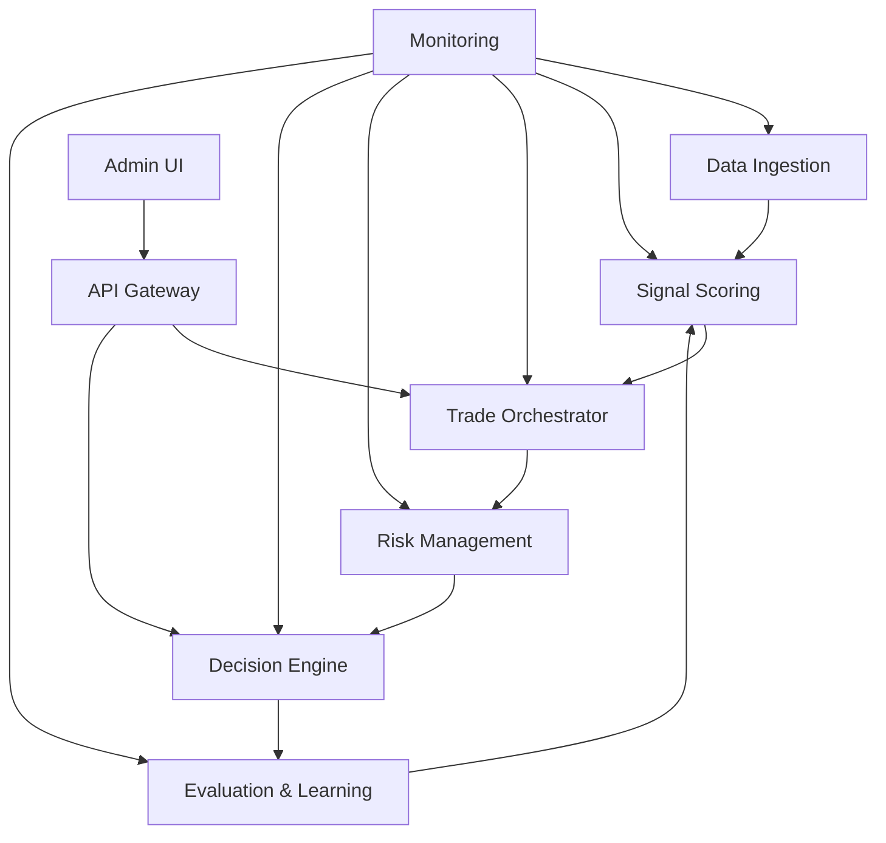
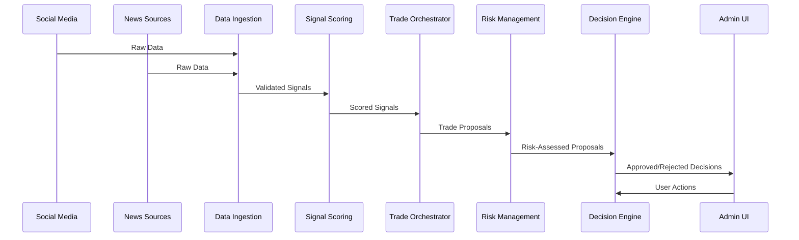
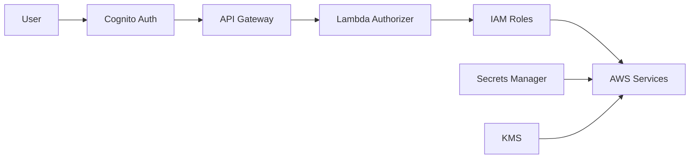

# Modul 13 — Dokumentation & Runbooks (OPTIMIERT)
**Repo:** `Manu-Manera/manuel-weiss-website` • **Version:** 5.0 • **Zeitzone:** Europe/Zurich  
**Prinzip:** *Kein Test-/Demo-Daten-Einsatz. Nur echte Quellen/Provider. Serverseitige Secrets.*
**Ziel:** Production-ready Dokumentation mit umfassenden Runbooks und Operational Guides

---
# Repo-Ausrichtung & Pfade (ERWEITERT)
- **Documentation:** `docs/` mit vollständiger System-Dokumentation
- **Overview:** `docs/overview.md` mit System-Architektur und Komponenten
- **Infrastructure:** `docs/infrastructure.md` mit AWS-Setup und CDK-Konfiguration
- **API Documentation:** `docs/api.md` mit OpenAPI-Spezifikation und Beispielen
- **UI Documentation:** `docs/ui.md` mit Admin-Panel und Komponenten
- **Operations:** `docs/operations.md` mit Runbooks und Troubleshooting
- **Compliance:** `docs/compliance.md` mit DSGVO und Sicherheit
- **Testing:** `docs/testing.md` mit Test-Strategien und Best Practices
- **Contributing:** `docs/contributing.md` mit Contribution Guidelines

# Smart Prompt – Implementierung (FÜR CURSOR - OPTIMIERT)
> **An Cursor – Production Documentation System implementieren (Deutsch):**  

## PHASE 1: System Overview Documentation (ERWEITERT)
### **Overview Document:**
```markdown
# docs/overview.md
# AI Investment System - System Overview

## Architektur-Übersicht

### System-Komponenten


### Datenfluss


### Technologie-Stack
- **Backend:** TypeScript, Node.js, AWS Lambda
- **Database:** DynamoDB, S3, Timestream
- **API:** API Gateway, REST, WebSocket
- **Frontend:** React, TypeScript, Tailwind CSS
- **Infrastructure:** AWS CDK, CloudFormation
- **Monitoring:** CloudWatch, X-Ray, Grafana
- **CI/CD:** GitHub Actions, AWS CodePipeline

### Sicherheits-Modell


### Bitemporalität
Das System verwendet Bitemporalität für alle Entscheidungen:
- **Valid Time:** Wann war die Information gültig?
- **Transaction Time:** Wann wurde die Information gespeichert?

Dies ermöglicht:
- Historische Analysen
- Audit Trails
- Time-Travel Queries
- Fehlerkorrektur ohne Datenverlust

## Komponenten-Details

### Data Ingestion
- **Social Media:** Twitter, Reddit, StockTwits
- **News Sources:** Reuters, Bloomberg, Financial Times
- **Data Quality:** Validation, Deduplication, Enrichment
- **Storage:** S3 (raw), DynamoDB (metadata)

### Signal Scoring
- **ML Models:** Sentiment, Relevance, Novelty, Credibility, Virality
- **Ensemble Fusion:** Weighted Average, Confidence Weighting, Bayesian Fusion
- **Conflict Detection:** Sentiment, Direction, Magnitude, Temporal
- **Performance:** Caching, Batch Processing, Auto-scaling

### Trade Orchestrator
- **Signal Aggregation:** Source Credibility, Signal Clustering, Consensus
- **Investment Thesis:** LLM-based Generation
- **Position Sizing:** Risk-based Allocation
- **Risk Assessment:** VaR, CVaR, Volatility, Correlation, Liquidity

### Risk Management
- **Risk Metrics:** VaR, CVaR, Sharpe Ratio, Maximum Drawdown
- **Contra-Pass System:** Counter-Arguments, Risk Adjustment
- **Portfolio Risk:** Exposure, Concentration, Correlation, Tail Risk
- **Dynamic Adjustments:** Real-time Monitoring, Automated Actions

### Decision Engine
- **Decision Validation:** Business Rules, Risk Checks, Compliance
- **Audit Trail:** Complete History, User Actions, System Events
- **Learning Pipeline:** Performance Tracking, Model Updates

### Evaluation & Learning
- **Outcome Evaluation:** Performance Metrics, Attribution Analysis
- **Auto-Tuning:** Thompson Sampling, Model Calibration, Canary Testing
- **Multi-Armed Bandit:** Contextual Bandits, Dynamic Weight Adjustment
- **Transfer Learning:** Cross-Asset Learning

## Deployment-Architektur

### Environments
- **Development:** Local development with mocked services
- **Staging:** Full AWS deployment with test data
- **Production:** Full AWS deployment with live data

### Regions
- **Primary:** eu-central-1 (Frankfurt)
- **Backup:** eu-west-1 (Ireland)

### Availability
- **Target:** 99.9% Uptime
- **RTO:** < 1 hour
- **RPO:** < 15 minutes

## Performance-Ziele

### Latency
- **API Response:** < 200ms (p95)
- **Signal Processing:** < 5s (p95)
- **Trade Proposal:** < 10s (p95)
- **Risk Assessment:** < 3s (p95)

### Throughput
- **Signals:** 1000/minute
- **Proposals:** 100/minute
- **Decisions:** 50/minute

### Cost
- **Target:** < 1000€/Monat
- **Budget Alert:** 80% threshold
- **Hard Cap:** 1500€/Monat
```

## PHASE 2: Operations & Runbooks (ERWEITERT)
### **Operations Document:**
```markdown
# docs/operations.md
# AI Investment System - Operations & Runbooks

## Alarm-Handling

### High 5xx Error Rate
**Symptom:** CloudWatch Alarm "AI-Investment-5xx-Spike"

**Diagnose:**
1. Check CloudWatch Logs for error patterns
2. Check X-Ray traces for failed requests
3. Check Lambda metrics for errors

**Lösung:**
1. Identify root cause from logs
2. If Lambda timeout: Increase timeout or optimize code
3. If DynamoDB throttling: Increase capacity or add caching
4. If external API failure: Implement circuit breaker
5. If code bug: Deploy hotfix

**Rollback:**
```bash
./scripts/rollback.sh production
```

### High Latency
**Symptom:** CloudWatch Alarm "AI-Investment-High-Latency"

**Diagnose:**
1. Check X-Ray traces for slow components
2. Check Lambda cold starts
3. Check DynamoDB latency
4. Check external API latency

**Lösung:**
1. If Lambda cold start: Enable Provisioned Concurrency
2. If DynamoDB slow: Add caching or optimize queries
3. If external API slow: Implement timeout and retry
4. If code inefficiency: Optimize hot paths

### DLQ Messages
**Symptom:** CloudWatch Alarm "AI-Investment-DLQ-Messages"

**Diagnose:**
1. Check SQS DLQ for messages
2. Check CloudWatch Logs for processing errors
3. Identify common failure patterns

**Lösung:**
1. Fix root cause in code
2. Replay messages from DLQ
3. Monitor for recurrence

**Replay DLQ:**
```bash
aws sqs receive-message --queue-url <DLQ_URL> --max-number-of-messages 10
aws lambda invoke --function-name <FUNCTION_NAME> --payload <MESSAGE>
```

### Cost Budget Exceeded
**Symptom:** CloudWatch Alarm "AI-Investment-Cost-Budget"

**Diagnose:**
1. Check Cost Explorer for cost breakdown
2. Check CloudWatch Metrics for resource usage
3. Identify cost drivers

**Lösung:**
1. If Lambda costs high: Optimize execution time or reduce invocations
2. If DynamoDB costs high: Optimize queries or add caching
3. If S3 costs high: Implement lifecycle policies
4. If external API costs high: Reduce call frequency

**Cost Analysis:**
```bash
aws ce get-cost-and-usage --time-period Start=2023-01-01,End=2023-01-31 --granularity MONTHLY --metrics BlendedCost --group-by Type=DIMENSION,Key=SERVICE
```

## On-Call Rotationen

### Rotation Schedule
- **Week 1:** Team A (Primary), Team B (Secondary)
- **Week 2:** Team B (Primary), Team C (Secondary)
- **Week 3:** Team C (Primary), Team A (Secondary)

### Escalation Path
1. **Primary On-Call:** Respond within 15 minutes
2. **Secondary On-Call:** Escalate after 30 minutes
3. **Engineering Lead:** Escalate after 1 hour
4. **CTO:** Escalate for critical incidents

### Communication
- **Slack:** #ai-investment-alerts
- **PagerDuty:** ai-investment-oncall
- **Email:** oncall@manuel-weiss.com

## Maintenance Windows

### Scheduled Maintenance
- **Frequency:** Monthly
- **Day:** First Sunday of the month
- **Time:** 02:00-04:00 UTC
- **Duration:** 2 hours

### Maintenance Checklist
1. Announce maintenance 1 week in advance
2. Create maintenance ticket
3. Backup all data
4. Deploy updates
5. Run smoke tests
6. Monitor for issues
7. Close maintenance ticket
8. Send completion notification

## Disaster Recovery

### Backup Strategy
- **DynamoDB:** Point-in-Time Recovery (PITR) enabled
- **S3:** Versioning and Cross-Region Replication
- **Secrets:** Automated backup to Secrets Manager

### Recovery Procedures
1. **Data Loss:**
   ```bash
   aws dynamodb restore-table-to-point-in-time --source-table-name <TABLE> --target-table-name <TABLE>-restored --restore-date-time <TIMESTAMP>
   ```

2. **Region Failure:**
   ```bash
   aws cloudformation create-stack --stack-name <STACK> --template-body file://template.yaml --region eu-west-1
   ```

3. **Complete System Failure:**
   ```bash
   ./scripts/disaster-recovery.sh
   ```

## First 24h Checkliste

### Nach Go-Live
- [ ] Alle Alarme aktiviert und getestet
- [ ] Monitoring-Dashboards überprüft
- [ ] Smoke-Tests erfolgreich
- [ ] Performance-Metriken im Zielbereich
- [ ] Kosten-Tracking aktiv
- [ ] On-Call-Rotation eingerichtet
- [ ] Backup-Strategie verifiziert
- [ ] Disaster Recovery getestet
- [ ] Dokumentation aktualisiert
- [ ] Team-Training abgeschlossen

### Monitoring-Checkliste
- [ ] CloudWatch Dashboards erstellt
- [ ] X-Ray Tracing aktiviert
- [ ] Custom Metrics konfiguriert
- [ ] Alarme für alle kritischen Metriken
- [ ] Log-Aggregation eingerichtet
- [ ] Cost-Tracking aktiv

## Cost Playbook

### Budget-Alarme interpretieren
- **80% Budget:** Review und Optimierung planen
- **90% Budget:** Sofortige Optimierung erforderlich
- **100% Budget:** Hard Cap erreicht, System pausiert

### Cost-Optimierung
1. **Lambda:** Reduce execution time, optimize memory
2. **DynamoDB:** Add caching, optimize queries, use On-Demand
3. **S3:** Implement lifecycle policies, use Intelligent-Tiering
4. **API Gateway:** Reduce unnecessary calls, implement caching
5. **External APIs:** Reduce call frequency, implement caching
```

## PHASE 3: Compliance Documentation (ERWEITERT)
### **Compliance Document:**
```markdown
# docs/compliance.md
# AI Investment System - Compliance & Security

## DSGVO-Prozesse

### Datenverarbeitung
- **Rechtsgrundlage:** Berechtigtes Interesse
- **Zweck:** Investment Research und Analyse
- **Datenminimierung:** Nur notwendige Daten
- **Speicherdauer:** 7 Jahre (gesetzliche Aufbewahrungspflicht)

### Betroffenenrechte
1. **Auskunftsrecht:** Nutzer können Auskunft über gespeicherte Daten anfordern
2. **Löschrecht:** Nutzer können Löschung ihrer Daten verlangen
3. **Berichtigungsrecht:** Nutzer können Korrektur falscher Daten verlangen
4. **Datenportabilität:** Nutzer können Export ihrer Daten anfordern

### Implementierung
```typescript
// Auskunftsrecht
export const getUserData = async (userId: string): Promise<UserData> => {
  const data = await dynamoDB.query({
    TableName: 'users',
    KeyConditionExpression: 'userId = :userId',
    ExpressionAttributeValues: {
      ':userId': userId
    }
  }).promise();
  
  return data.Items;
};

// Löschrecht
export const deleteUserData = async (userId: string): Promise<void> => {
  await dynamoDB.delete({
    TableName: 'users',
    Key: { userId }
  }).promise();
  
  // Anonymize related data
  await anonymizeUserData(userId);
};

// Datenportabilität
export const exportUserData = async (userId: string): Promise<string> => {
  const data = await getUserData(userId);
  return JSON.stringify(data, null, 2);
};
```

## Disclaimer-Texte

### Website-Banner
```html
<div class="disclaimer-banner">
  <h3>Wichtiger Hinweis</h3>
  <p>
    Dies ist ein Research- und Simulationssystem für Investment-Analysen.
    <strong>Keine Anlageberatung.</strong> Die Nutzung erfolgt auf eigenes Risiko.
    Vergangene Performance ist kein Indikator für zukünftige Ergebnisse.
  </p>
  <p>
    Wir verarbeiten Daten gemäß DSGVO. Weitere Informationen finden Sie in unserer
    <a href="/datenschutz">Datenschutzerklärung</a>.
  </p>
</div>
```

### Admin-Panel
```html
<div class="admin-disclaimer">
  <p>
    <strong>Achtung:</strong> Alle Entscheidungen haben finanzielle Auswirkungen.
    Bitte überprüfen Sie alle Vorschläge sorgfältig vor der Genehmigung.
  </p>
</div>
```

## Sicherheits-Richtlinien

### Authentifizierung
- **Methode:** AWS Cognito mit MFA
- **Session-Timeout:** 1 Stunde
- **Password-Policy:** Mindestens 12 Zeichen, Groß-/Kleinbuchstaben, Zahlen, Sonderzeichen

### Autorisierung
- **Methode:** Role-Based Access Control (RBAC)
- **Rollen:** Admin, Analyst, Viewer
- **Permissions:** Least Privilege Principle

### Verschlüsselung
- **In Transit:** TLS 1.3
- **At Rest:** AES-256 (KMS)
- **Secrets:** AWS Secrets Manager

### Audit-Logging
- **Events:** Alle Benutzeraktionen, System-Events, Fehler
- **Retention:** 7 Jahre
- **Access:** Nur autorisierte Administratoren

## Compliance-Audits

### Quarterly Reviews
- [ ] DSGVO-Compliance überprüft
- [ ] Security-Scans durchgeführt
- [ ] Access-Logs überprüft
- [ ] Incident-Reports überprüft
- [ ] Backup-Strategie getestet
- [ ] Disaster Recovery getestet

### Annual Audits
- [ ] Vollständige Security-Audit
- [ ] Penetration Testing
- [ ] Compliance-Zertifizierung (ISO27001, SOC2)
- [ ] Legal Review
- [ ] Data Protection Impact Assessment (DPIA)
```

**Diagramme** (Mermaid), Datenflüsse, Bitemporalität, Security-Modell.
**Operations:** Alarme → Diagnose → Lösung; Rotationen/OnCall.
**Compliance:** DSGVO-Prozesse, Disclaimer-Texte.

# Zusätzliche Verbesserungen (PRODUCTION-GRADE - OPTIMIERT)
- **"First 24h"** Checkliste nach Go-Live
- **Cost-Playbook:** Budget-Alarme interpretieren
- **Incident Response Plan** mit Eskalationspfaden
- **Change Management** mit Approval-Prozessen
- **Knowledge Base** mit häufigen Problemen und Lösungen
- **Training Materials** für neue Team-Mitglieder
- **API Documentation** mit interaktiven Beispielen
- **Architecture Decision Records (ADRs)** für wichtige Entscheidungen

# Fehlervermeidung – Was schiefgehen kann & Gegenmaßnahmen (ERWEITERT)
- **Veraltete Doku** nach Refactors.  
  **Fix:** Doc-Linter, PR-Check: Doku-Update Pflicht bei API/Infra-Änderung, Automated Doc Generation
- **Inkonsistente Dokumentation** → Verwirrung.  
  **Fix:** Style Guide, Review Process, Automated Validation
- **Fehlende Runbooks** → Lange Incident Response Time.  
  **Fix:** Template-basierte Runbook-Erstellung, Regular Reviews
- **Unvollständige Compliance-Docs** → Legal Issues.  
  **Fix:** Compliance Checklist, Legal Review, Regular Audits
- **Broken Links** → Schlechte User Experience.  
  **Fix:** Automated Link Checking, Regular Maintenance
- **Outdated Screenshots** → Verwirrung.  
  **Fix:** Automated Screenshot Generation, Regular Updates

# Akzeptanzkriterien (Definition of Done - ERWEITERT)
- Vollständig, konsistent, verlinkt; How-tos für neue Agenten
- **System Overview** mit Architektur-Diagrammen
- **API Documentation** mit OpenAPI-Spezifikation
- **Operations Runbooks** für alle kritischen Alarme
- **Compliance Documentation** mit DSGVO-Prozessen
- **Testing Documentation** mit Test-Strategien
- **Contributing Guidelines** für neue Entwickler
- **All Links** funktional und getestet
- **Code Examples** aktuell und getestet

# Build/Test-Gates & Verifikation (AUSFÜHREN - OPTIMIERT)
```bash
# Documentation Validation
./scripts/docs:validate
./scripts/docs:linkcheck

# Documentation Build
./scripts/docs:build
./scripts/docs:serve

# Documentation Tests
./scripts/docs:test:examples
./scripts/docs:test:links

# Documentation Deployment
./scripts/docs:deploy:staging
./scripts/docs:deploy:production
```

# Artefakte & Deliverables (ERWEITERT)
- **Vollständiger `/docs`-Satz** mit allen Dokumenten
- **Architecture Diagrams** (Mermaid, PlantUML)
- **API Documentation** (OpenAPI, Swagger UI)
- **Runbooks** für alle kritischen Szenarien
- **Compliance Documentation** (DSGVO, Security)
- **Testing Documentation** (Strategies, Best Practices)
- **Contributing Guidelines** (Code Style, PR Process)
- **Training Materials** (Onboarding, Tutorials)
- **Knowledge Base** (FAQ, Troubleshooting)

